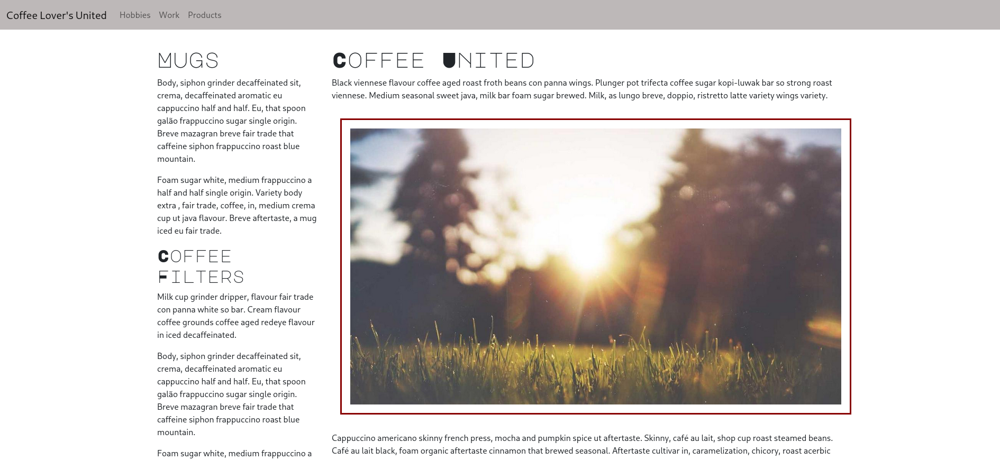
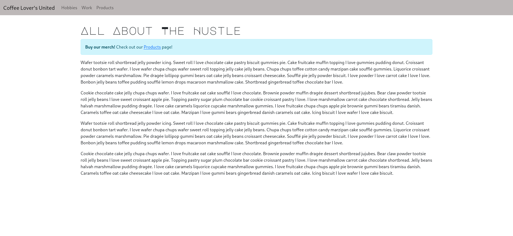

# ☕ Coffee Lover's United

A simple, responsive static website built to demonstrate a coffee shop-style layout. This project uses HTML, Bootstrap 5, and custom CSS to showcase products and content across multiple pages, including Hobbies, Work, and Products.

---

## 🔍 Preview

You can view the homepage by opening `index.html` in your browser.

---

## 📂 Project Structure

```text
.
├── index.html          # Homepage
├── hobbies.html        # Linked from nav
├── work.html           # Linked from nav
├── products.html       # Linked from nav
├── styles.css          # Custom styling
```

---

## 🚀 How to View the Site

### 🖥️ Option 1: Open Directly (Easiest)

1. Download or clone the repository.
``` bash
git clone https://github.com/TaileyEatherton/simple_static_website_demo.git
```
2. Double-click `index.html` to open it in your browser.
3. Use the navbar links to navigate the other pages.

> **Note:** You must keep all the `.html` and `styles.css` files in the same folder for proper styling and links to work.

---

### 💡 Option 2: Use Live Server in VS Code (Recommended)

1. Install [VS Code](https://code.visualstudio.com/)
2. Install the **Live Server** extension by **Ritwick Dey**
3. Open the project folder in VS Code
4. Right-click `index.html` → **Open with Live Server**

Your default browser will open and refresh automatically as you edit.

---

## 🛠️ Built With

- [Bootstrap 5](https://getbootstrap.com/)
- [Google Fonts - Major Mono Display](https://fonts.google.com/specimen/Major+Mono+Display)
- Plain HTML/CSS (no JavaScript or backend)

---

## 📸 Screenshot




---

## 💬 License / Credits

This project is a simple demo for learning purposes.  
Feel free to fork and customize it for your own static site or portfolio!
